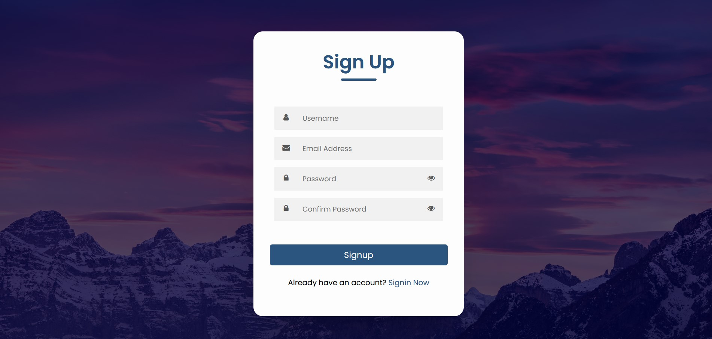
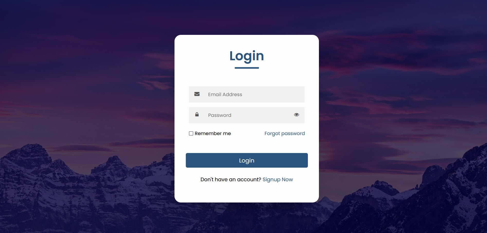

[http://onixsat88.atwebpages.com/signup.php](http://onixsat88.atwebpages.com){:target="_blank"}.
<h1 style="color:blue;">PHP MySQL User Signup Login System</h1>

Um formulário de login e inscrição usando HTML, PHP e MySQL. Este formulário permite aos utilizadores registarem-se e iniciarem sessão. Todas as informações são armazenadas em um banco de dados MySQL. Após o login bem-sucedido, o usuário é redirecionado para seu painel. Eu gosto muito de fazer software! Por favor, se vir algum problema, dê-lhe a conhecer!

## Technologies Used
- `HTML`
- `CSS`
- `JavaScript`
- `Bootstrap5`
- `PHP`
- `MySQL`

## Files
- *home.php* -- The main page showed after login. Edit your own homepage.
- *index.php* -- The main page showed before login.
- *login.php* -- Login Page.
- *signup.php* -- Signup Page.
- *edit.php* -- Edit your profile.
- *logout.php* -- Logout to the dashboard page.

## Features

* Stores passwords in DB as hashes
* Easy logout via logout.php
* Passwords are hashed and stored (You can't view the original password of the user).
* Username and email validation is done.

## How to Use

- Download all the source files to your computer.
- Create a DataBase as login in phpMyAdmin.
- Create users table in phpMyAdmin.
- Change the username and password in connection.php file.
- Create four columns id, name, email, password in the users table.
- Or import the [login_system.sql](loginsystem.sql) file in the phpMyAdmin.
- Save the files, upload them to your webserver and give it a try.

## Preview

### Homepage

### Signup Page

### Signin Page

### Dashboard Page

### Update Profile Page

